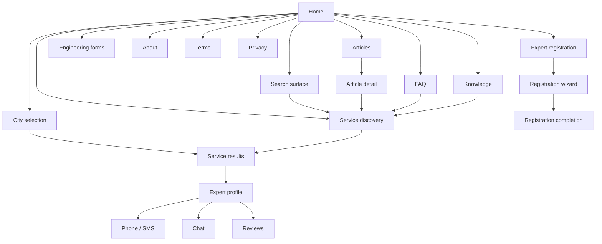
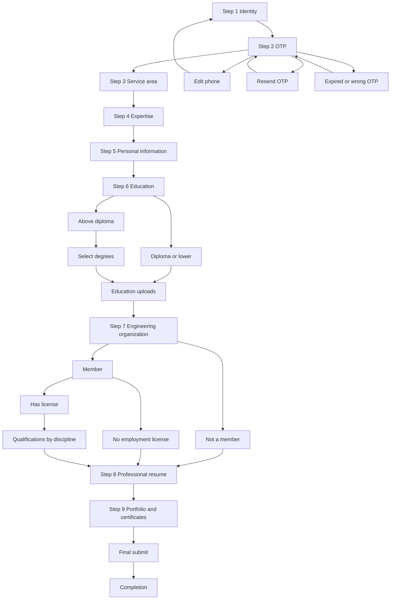

# Product Flows

Authoritative product navigation and flow specification for the Mohandes Man
frontend, derived from the employer legacy files and classified in
[LEGACY-AUDIT.md](LEGACY-AUDIT.md).

This document is the flow contract **before** implementation. It does not
create routes, domain components, or API clients.

Classification reminder: **SOURCE REQUIREMENT**, **UX COMPLETION**,
**BUSINESS DECISION REQUIRED**, **LEGACY ISSUE**, **TECHNICAL MIGRATION NOTE**.

---

## Global Product Flow



Chat, save, share, review submission, and forms download are present in legacy
UI but are **not** automatically Phase 1. See [Phase 1 Scope Matrix](PHASE-1-SCOPE.md).

---

## Find a Specialist Flow

Customer discovery is the primary storefront journey.

```text
Home
  → choose city (optional in legacy; default display "رشت")
  → choose or search a service
  → view service results
  → apply filters
  → inspect expert
  → contact expert
```

| Step             | Source evidence                                    | API needed | Notes                                       |
| ---------------- | -------------------------------------------------- | ---------- | ------------------------------------------- |
| No city selected | Trigger shows `انتخاب شهر`; pages still show `رشت` | Likely     | **LEGACY ISSUE**: hardcoded default         |
| Choose city      | Multi-select + `localStorage.selectedCities`       | Likely     | Names, not IDs, stored                      |
| Change city      | Display text updates; listing does **not** refetch | Yes        | **UX COMPLETION**: results must follow city |
| Choose service   | Six home tiles + menu                              | No         | Static IA                                   |
| Search           | Offcanvas shell; no results                        | Yes        | **UX COMPLETION**                           |
| View results     | Static demo cards, count `23`                      | Yes        |                                             |
| Filters          | Chips + radios; no listing effect                  | Yes        | **UX COMPLETION**                           |
| Clear filter     | Remove button restores chip chrome only            | Yes        |                                             |
| No result        | Copy + `تغییر شهر انتخابی` on 5/6 pages            | Likely     | Missing on building-permit                  |
| Load more        | Button, no JS                                      | Yes        | **UX COMPLETION**                           |
| Inspect expert   | `/resume.html` (no id)                             | Yes        |                                             |
| Loading / error  | Absent                                             | Yes        | **UX COMPLETION**                           |

**TECHNICAL MIGRATION NOTE:** city and filters must become query parameters or
server state. Do not keep `localStorage` as the only source of truth for SEO
service pages.

---

## Expert Registration Flow



Inferred UX states (not in legacy, labeled **UX COMPLETION**): Edit phone
returning to step 1, resend that actually resends, expired/wrong OTP, upload
failure, network error, duplicate identity, completion screen.

Do not treat `step3.html` as resend. Do not invent the completion destination.

Back navigation, progress, drafts, and step guards are missing in source.
See Product Decisions Required.

---

## Article Flow

```text
Home / Footer / Menu
  → Articles home
      → optional search / category / sort
      → all articles
      → OR category listing
          → article detail
              → table of contents
              → article FAQs
              → related articles
              → category browse
              → CTA to related service (surveying in the sample)
```

Landing, all-articles, and category listing are variants of one list surface.
Detail is a long-form reading page. Search/sort are unwired in legacy
(**UX COMPLETION**, API-dependent).

---

## FAQ Flow

```text
Home / Footer / Menu / service FAQ control
  → FAQ landing (category cards)
      → FAQ category page (accordion)
          → related service CTA
          → related categories
```

Only surveying currently has a category page. Other cards are `#`, missing
hrefs, or dead fragments. New IA should use a generic category route. Missing
category content must not be fabricated (**LEGACY ISSUE** + **SOURCE REQUIREMENT**
for content).

Ask-a-question modal is a shell — **BUSINESS DECISION REQUIRED**.

---

## Knowledge Flow

```text
Home carousel / Footer / Menu
  → Knowledge landing
      → Category
          → Tips
          → Load more
          → Related service CTA
```

Only surveying tips exist. Other categories are `#`. Load more is unwired.
**UX COMPLETION** for pagination; **BUSINESS DECISION REQUIRED** for remaining
categories’ content.

---

## Engineering Forms Flow

```text
Footer / Knowledge area (legacy file lives under knowledge/)
  → Engineering forms
      → search
      → province filter
      → category filter
      → named form
      → download
```

Legacy page is a stub (one row, icon without URL). Loading, empty, error, and
unavailable-file states are **UX COMPLETION**. Metadata must not be invented.

---

## Missing / Incomplete Flow Register

| Source                          | Issue                                                        | Classification                 | Impact                     | Recommended Handling                         | Decision Needed |
| ------------------------------- | ------------------------------------------------------------ | ------------------------------ | -------------------------- | -------------------------------------------- | --------------- |
| Home popular services           | All tiles `href="#"`                                         | **LEGACY ISSUE**               | Dead-end discovery         | Map each tile to a service or subcategory    | Yes             |
| Home drawing consultation       | All tiles `href="#"`                                         | **LEGACY ISSUE**               | Dead-end                   | Map to drawing service + tab                 | Yes             |
| Home FAQ menu / modal           | Only surveying wired; others `#` or no href; typo `ثبت نامن` | **LEGACY ISSUE**               | Broken IA                  | Generic FAQ category route; do not invent Qs | Content         |
| Home footer contractors         | Four links have no `href`                                    | **LEGACY ISSUE**               | Dead nav                   | Map to workers service / subtype             | Yes             |
| Home social                     | All `#`                                                      | **LEGACY ISSUE**               | Dead social                | Real URLs or hide                            | Yes             |
| Home search                     | Opens shell; no query, results, empty                        | **UX COMPLETION**              | Core discovery incomplete  | Implement search against API                 | Scope + API     |
| Search copy                     | “خدمات و متخصصین” vs “خدمات، سرویس‌ها”                       | **BUSINESS DECISION REQUIRED** | Unclear index              | Choose services, experts, or both            | Yes             |
| Search category `محاسبات`       | In search/registration, not a home tile                      | **BUSINESS DECISION REQUIRED** | IA conflict                | Seventh service vs drawing subtype           | Yes             |
| City search / popular / confirm | UI present, JS missing or broken                             | **LEGACY ISSUE**               | Incomplete city UX         | Complete customer city selector              | No (UX)         |
| City dataset                    | Two provinces + misplaced Tehran                             | **UX COMPLETION**              | Cannot pick most cities    | Full Iran dataset from API                   | API             |
| City vs results                 | localStorage does not filter experts                         | **LEGACY ISSUE**               | Misleading count           | Server filter by city                        | API             |
| Registration vs discovery city  | Two different models                                         | **SOURCE REQUIREMENT**         | Wrong reuse risk           | Separate components                          | No              |
| Nearby city rules               | “30 km” and “unlimited” with static list                     | **BUSINESS DECISION REQUIRED** | Matching rules unknown     | Product + API                                | Yes             |
| Expert showcase                 | Duplicate demo; pause unwired                                | **LEGACY ISSUE**               | Fake social proof          | Real featured experts or drop                | Yes             |
| Home testimonials               | Duplicate slides; 4-digit OTP; missing phone-edit canvas     | **LEGACY ISSUE**               | Incomplete UGC             | Confirm if home reviews are in scope         | Yes             |
| Service Gen A vs B              | Two templates                                                | **LEGACY ISSUE**               | Inconsistent UX            | One discovery architecture                   | No              |
| Non-survey service copy         | Surveying accordion/FAQ/skills cloned                        | **LEGACY ISSUE**               | Wrong content              | Replace with real copy; do not invent        | Content         |
| Building permit                 | No empty-result UI                                           | **UX COMPLETION**              | Missing state              | Shared empty pattern                         | No              |
| Load more                       | Button, no behavior                                          | **UX COMPLETION**              | Pagination unknown         | API page/cursor                              | API             |
| Filters                         | Visual only                                                  | **UX COMPLETION**              | Users think results change | Bind to query                                | API             |
| Expert card CTA                 | Always `/resume.html`                                        | **TECHNICAL MIGRATION NOTE**   | No identity                | `/experts/[id]`                              | API             |
| Suggested experts               | Surveying only; `href="#"`                                   | **LEGACY ISSUE**               | Dead CTA                   | Confirm product; then API                    | Yes             |
| Profile save / share            | Labels only                                                  | **UX COMPLETION**              | Incomplete chrome          | Confirm Phase 1                              | Yes             |
| Profile chat                    | DOM mock; wrong name                                         | **LEGACY ISSUE**               | Fake messaging             | Confirm Phase 1                              | Yes             |
| Profile reviews                 | Auth modal broken; 4 vs 5 digit OTP                          | **LEGACY ISSUE**               | Cannot submit              | Confirm auth model                           | Yes             |
| Profile missing states          | No unverified / inactive / empty / error                     | **UX COMPLETION**              | Broken API responses       | Design empty/error                           | No              |
| Step 2 resend                   | Navigates to step 3                                          | **LEGACY ISSUE**               | Wrong flow                 | Resend API; stay on OTP                      | API             |
| Step 2 edit phone               | `href="#"`                                                   | **UX COMPLETION**              | Cannot correct number      | Return to step 1                             | No              |
| Steps 6–7 continue              | Dead buttons                                                 | **LEGACY ISSUE**               | Wizard cannot finish       | Wire linear next                             | No              |
| Step 8 submit                   | Posts `/submit-resume` instead of step 9                     | **LEGACY ISSUE**               | Broken chain               | Continue to portfolio                        | No              |
| Step 3 vs 5 location            | Asked twice, different value schemes                         | **BUSINESS DECISION REQUIRED** | Conflicting data           | One source of truth                          | Yes             |
| Expertise catalog               | Missing id 18; thin ostadkar/peymankar trees                 | **LEGACY ISSUE**               | Incomplete taxonomy        | Confirm catalog with employer                | Yes             |
| Wizard progress / back / draft  | Absent                                                       | **UX COMPLETION**              | Drop-off, data loss        | Add UX; draft is a business decision         | Draft: yes      |
| Registration success            | Absent                                                       | **UX COMPLETION**              | Dead end after submit      | Completion screen; destination unknown       | Yes             |
| Articles all-articles link      | Nested `articles/articles/...`                               | **LEGACY ISSUE**               | 404                        | Semantic list route                          | No              |
| Article cards                   | `/article/...` not matching files                            | **LEGACY ISSUE**               | Broken detail              | `/articles/[slug]`                           | No              |
| Article related / categories    | `#`                                                          | **LEGACY ISSUE**               | Dead-end reading           | Wire when content exists                     | Content         |
| FAQ categories                  | Placeholders                                                 | **LEGACY ISSUE**               | Incomplete FAQ             | Route exists; content later                  | Content         |
| FAQ back `FAQs.html`            | Missing file                                                 | **LEGACY ISSUE**               | 404                        | `/faq`                                       | No              |
| Knowledge `knowledge-page.html` | Missing file                                                 | **LEGACY ISSUE**               | 404                        | `/knowledge/[category]`                      | No              |
| Knowledge other categories      | `#`                                                          | **LEGACY ISSUE**               | Incomplete KB              | Do not invent tips                           | Content         |
| Knowledge load more             | Unwired                                                      | **UX COMPLETION**              | Unclear pagination         | Confirm API                                  | Yes             |
| Forms page                      | Stub; no file URL                                            | **LEGACY ISSUE**               | Feature not usable         | Confirm if Phase 1                           | Yes             |
| About card blurbs               | Surveying copied onto all services                           | **LEGACY ISSUE**               | Misleading about           | Correct copy                                 | Content         |
| Terms/privacy capabilities      | Accounts, payment, deletion, complaints                      | **BUSINESS DECISION REQUIRED** | Legal/product mismatch     | Do not add UI by default                     | Yes             |
| Auth modal legal links          | `#`                                                          | **LEGACY ISSUE**               | Unaccepted terms           | Point to `/terms` and `/privacy-policy`      | No              |
| Customer account                | Review OTP shells only; terms describe password accounts     | **BUSINESS DECISION REQUIRED** | Auth model unclear         | Confirm before building customer auth        | Yes             |

---

## Proposed Next.js Route Map

Follow established App Router rules: thin pages, groups `(auth)` and `(shop)`,
kebab-case. Do **not** create these files in TASK 01.

`docs/DEVELOPMENT.md` still shows example paths `sign-in` and `engineers/[id]`.
Those were foundation examples. Audited product language is **متخصص / expert**,
covering engineers, contractors, and trades. This map uses `experts`.

### Public storefront — `(shop)` and root

| Route                         | Product area             |
| ----------------------------- | ------------------------ |
| `/`                           | Home                     |
| `/services/[slug]`            | Service discovery        |
| `/experts/[id]`               | Expert profile           |
| `/articles`                   | Articles home / all      |
| `/articles/categories/[slug]` | Article category listing |
| `/articles/[slug]`            | Article detail           |
| `/faq`                        | FAQ landing              |
| `/faq/[category]`             | FAQ category             |
| `/knowledge`                  | Knowledge landing        |
| `/knowledge/[category]`       | Knowledge tips           |
| `/engineering-forms`          | Engineering forms        |
| `/about`                      | About                    |
| `/terms`                      | Terms                    |
| `/privacy-policy`             | Privacy                  |

Proposed service slugs (semantic, not legacy filenames):

| Slug                      | Service                 |
| ------------------------- | ----------------------- |
| `land-surveying`          | نقشه برداری             |
| `construction-workers`    | استادکار و پیمانکار     |
| `drawing`                 | ترسیم نقشه              |
| `interior-design`         | طراحی نما و داخلی       |
| `building-permit`         | پروانه ساخت و پایان کار |
| `administrative-services` | خدمات اداری             |

Drawing/worker **tabs** stay as query or in-page tabs until product decides
nested routes. Do not add `/services/drawing/architecture` without a decision.

### Expert registration — `(auth)`

| Route                                           | Wizard step                               |
| ----------------------------------------------- | ----------------------------------------- |
| `/expert-registration`                          | 1 Identity                                |
| `/expert-registration/otp`                      | 2 OTP                                     |
| `/expert-registration/service-area`             | 3                                         |
| `/expert-registration/expertise`                | 4                                         |
| `/expert-registration/personal-info`            | 5                                         |
| `/expert-registration/education`                | 6                                         |
| `/expert-registration/engineering-organization` | 7                                         |
| `/expert-registration/professional-resume`      | 8                                         |
| `/expert-registration/portfolio`                | 9                                         |
| `/expert-registration/complete`                 | **UX COMPLETION** (no source destination) |

Query params (later, not invented APIs): service filters, city ids, article
sort. Registration should not be deep-linkable to later steps without
server/session proof — **BUSINESS DECISION REQUIRED**.

Customer login is **not** given a route here because legacy only shows OTP
modals on review/comment, while terms describe username/password accounts.

---

## Route Link Matrix

| Source Area            | User Action                       | Destination                           | Legacy Status                           | Proposed Behavior                           |
| ---------------------- | --------------------------------- | ------------------------------------- | --------------------------------------- | ------------------------------------------- |
| Home                   | Open service tile                 | `/services/[slug]`                    | Six real HTML files                     | Same six services                           |
| Home                   | Search                            | Search surface → service or results   | Offcanvas, no results                   | Complete search (**UX COMPLETION**)         |
| Home                   | Select city                       | Persist + apply on results            | localStorage names; listing static      | Persist ids; refetch                        |
| Home                   | Join as specialist                | `/expert-registration`                | `auth/step1.html`                       | Wizard start                                |
| Home                   | Open article hub                  | `/articles`                           | `article-landing.html`                  | Articles home                               |
| Home / footer          | FAQ                               | `/faq`                                | `landig-faq.html`                       | FAQ landing                                 |
| Home / footer          | Knowledge                         | `/knowledge`                          | `knowledge-category.html`               | Knowledge landing                           |
| Home / footer          | About / terms / privacy           | `/about`, `/terms`, `/privacy-policy` | Real files                              | Same                                        |
| Home popular / drawing | Click tile                        | Unknown                               | `#`                                     | Map after product decision                  |
| Service                | Open expert                       | `/experts/[id]`                       | `/resume.html`                          | Identified profile                          |
| Service                | Change city / filters / load more | Same service route                    | UI only                                 | Query-driven list                           |
| Service                | Empty result → change city        | City selector                         | Present on 5/6 pages                    | Shared empty + city sheet                   |
| Expert                 | Phone / SMS                       | Device protocols                      | Present; placeholder `tel:09...`        | Real numbers when API provides              |
| Expert                 | Chat / save / share / review      | Unconfirmed                           | Incomplete mocks                        | See Phase 1 matrix                          |
| Article                | Open detail                       | `/articles/[slug]`                    | `/article/...` 404s                     | Canonical slug                              |
| Article                | Related service CTA               | `/services/land-surveying`            | Surveying only in sample                | Related service when tagged                 |
| FAQ                    | Open category                     | `/faq/[category]`                     | Only surveying exists                   | Generic route; missing content not invented |
| FAQ                    | Related service                   | Matching `/services/[slug]`           | Surveying CTA works                     | Same pattern per category                   |
| Knowledge              | Open category                     | `/knowledge/[category]`               | Wrong/missing files                     | Generic route                               |
| Knowledge              | Expert/service CTA                | `/services/[slug]`                    | Surveying only                          | Same pattern                                |
| Engineering forms      | Download                          | File URL                              | Icon only                               | API file when in scope                      |
| Registration step      | Next                              | Next wizard route                     | Mixed POST / dead buttons / wrong hrefs | Linear guarded wizard                       |
| Registration step      | Previous                          | Previous wizard route                 | Almost absent                           | **UX COMPLETION**                           |
| OTP                    | Resend                            | Stay on OTP                           | Goes to step 3                          | Resend API                                  |
| OTP                    | Edit phone                        | Step 1                                | `#`                                     | Return to identity                          |
| Final registration     | Submit success                    | `/expert-registration/complete`       | Missing                                 | **UX COMPLETION**; redirect unknown         |
| Footer legal           | Privacy / terms                   | Legal routes                          | Real files                              | Same                                        |
| Auth/review modals     | Legal acceptance                  | Legal routes                          | `#`                                     | Wire to `/terms` and `/privacy-policy`      |

---

## Design System Relationship

TASK 00.5 primitives are the visual and accessibility source of truth. Domain
and layout components should **compose** them. Do not modify primitives because
legacy Bootstrap markup looks different. Do not import legacy CSS/JS.

| Legacy pattern             | Compose from                                         |
| -------------------------- | ---------------------------------------------------- |
| Modal / offcanvas          | `ResponsiveDialog` (Drawer on mobile)                |
| Form controls              | Field, Input, Textarea, Select, Checkbox, RadioGroup |
| OTP                        | OtpInput (`length={5}` for registration)             |
| Uploads                    | FileUpload                                           |
| Badges (فعال، تایید شده)   | Badge                                                |
| Avatar                     | Avatar                                               |
| Accordion FAQ              | Accordion                                            |
| Service / article tabs     | Tabs                                                 |
| Loading listing            | Skeleton / Spinner                                   |
| Empty expert/search result | Empty                                                |
| Progress (wizard)          | Progress                                             |
| Alerts / field errors      | Alert / Field error                                  |
| Expert/article surfaces    | Card                                                 |

Do not implement these compositions in TASK 01.

---

## Product Decisions Required

Only questions that cannot be answered from source.

### P0 — Blocks Implementation

1. **Registration completion destination.** There is no success page or redirect
   in source. Where does the specialist go after final submit?
2. **Registration draft and step guards.** Can users refresh, use browser Back,
   or skip to step 7? Is draft server-side, client-side, or none?
3. **Customer city matching rules.** Multi-select is in the UI, but AND/OR,
   maximum cities, and whether results load without a city are undefined.
4. **Search index.** Is global search services, experts, or both? Copy
   contradicts itself.
5. **Step 3 vs step 5 location.** Is personal-info location a confirmation, a
   second field (mislabelled birth), or a duplicate bug?
6. **Service taxonomy.** Is `محاسبات ساختمان` a seventh service? Are worker and
   drawing tabs subtypes or separate routes? What is the real skill catalog
   for non-survey services (legacy is cloned surveying)?

### P1 — Important Before Integration

1. **Customer account model.** Terms describe username/password accounts;
   review UI shows phone OTP (4 digits vs registration’s 5). Which is real?
2. **Review authentication and anonymity.** Implied but incomplete. Who may
   submit? Are home testimonials the same product as profile reviews?
3. **Chat scope.** Local mock only. Real-time? Attachments? Auth?
4. **Save / share scope.** Labels only. Auth? List of saved experts? Native
   share vs copy link?
5. **Nearby-city limits** for registration (radius, max, required?).
6. **Expertise catalog completeness** (missing value 18, thin trade trees,
   licence vs edari overlap, software-without-expertise).
7. **Education labels** (“دیپلم و بالاتر” vs above diploma) and whether files
   are required.
8. **Article/FAQ/knowledge/forms data source** and which categories actually
   have content.
9. **Forms download backend** (the page is a stub).
10. **Featured experts, banners, social URLs.**

### P2 — Can Be Deferred

1. Home article strip (not on the landing body).
2. Suggested-experts rail on every service.
3. Related articles on service pages (absent).
4. Cookie consent UI (privacy mentions cookies).
5. Payment, platform fees, complaint intake, account deletion — mentioned in
   legal text only. Do not add to Phase 1 unless contracted.
6. Exact banner click-through campaigns.
7. Geolocation “near me” (not in customer city UI).
